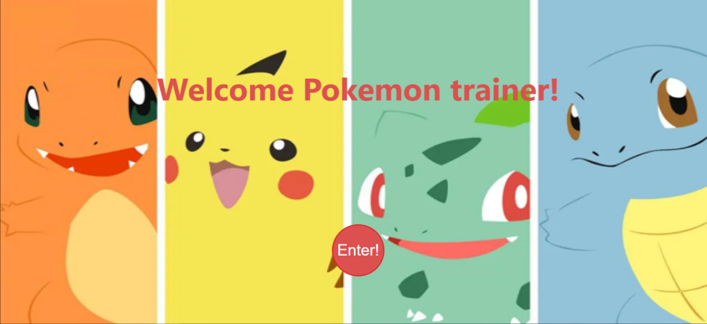
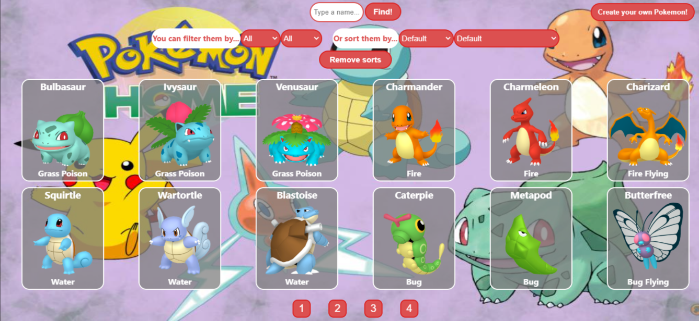
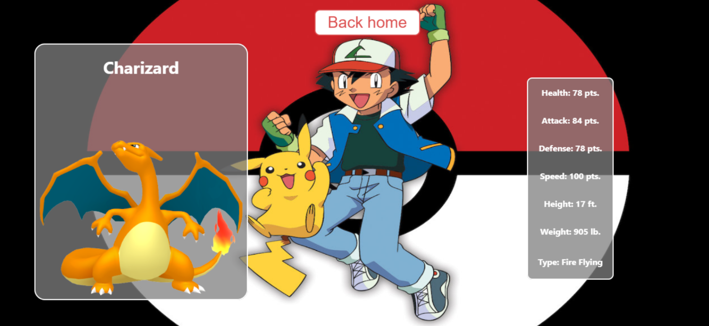
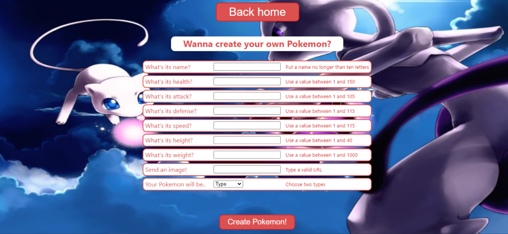

# Hi there, I'm Mauro! 👋

## 💻 I'm a Full Stack web developer.

I began my web development career as a self-taught student, learning with material of different platforms such as FreeCodeCamp or YouTube to name a few. I've also taken a few conferences on the UBA (Universidad de Buenos Aires). These tools helped me to gain more confidence on my learning process and my skills.

Later, and thanks to Henry, I was able to get to work and collaborate with other people in these areas, and acquire greater depth in my knowledge. The technologies and tools that I've been learning and using are:
- HTML, CSS, JavaScript
- React JS, Redux Toolkit
- Node JS, Express, SQL, PostgreSQL, Sequelize
- Vercel, Heroku, SCRUM

## 👇 Take a look at my Pokemon App.

It´s a SPA (Single Page Application) developed with:

- 🎨 Front-End: React JS, Redux Toolkit, CSS Modules
- 🛠 Back-End: Node JS, Express
- 📝 Database: Sequelize, PostgreSQL
- 🌎 Deploy: https://pokemon-app-henna.vercel.app/

## 📬 If you want to contact me, you can use...

<!--
**MauroR7GH/MauroR7GH** is a ✨ _special_ ✨ repository because its `README.md` (this file) appears on your GitHub profile.

Here are some ideas to get you started:

- 🔭 I’m currently working on ...
- 🌱 I’m currently learning ...
- 👯 I’m looking to collaborate on ...
- 🤔 I’m looking for help with ...
- 💬 Ask me about ...
- 📫 How to reach me: ...
- 😄 Pronouns: ...
- ⚡ Fun fact: ...
-->
