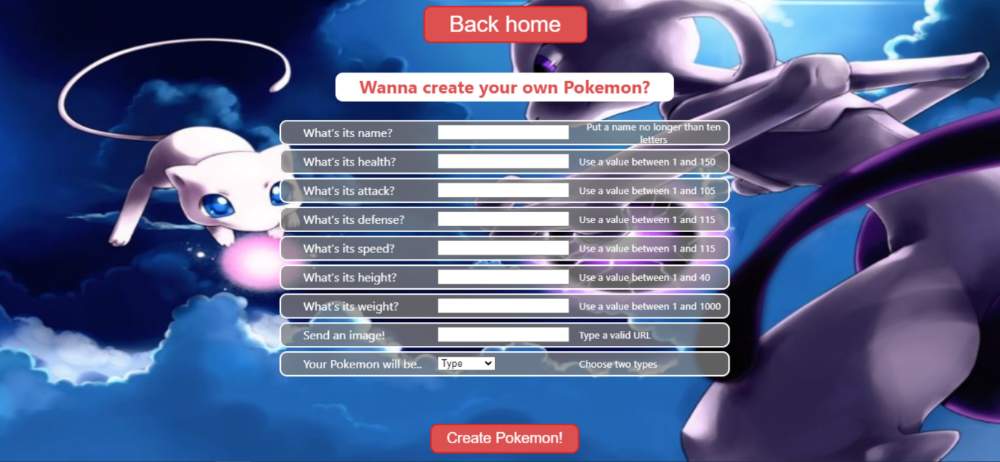

# Hi there, I'm Mauro! 👋

## 💻 I'm a Full Stack web developer.

I began to train myself in programming and web development by my own, with conferences and small training sessions by professors of the UBA (Universidad de Buenos Aires), and also with online material (YouTube, FreeCodeCamp). By this way, I was confirming my interest in this exciting world more and more.

Later, and thanks to Henry, I was able to get to work and collaborate with other people in these areas, and acquire greater depth in my knowledge. The technologies and tools that I've been learning and using are: HTML, CSS, JavaScript, React JS, Redux, Redux Toolkit, Node JS, Express, SQL, PostgreSQL, Sequelize, etc.

## 👇 Take a look at my Pokemon App.

It´s a SPA (Single Page Application) developed with:

- 🎨 Front-End: React JS, Redux Toolkit
- 🛠 Back-End: Node JS, Express
- 📝 Database: Sequelize, Postgres

## 📬 If you want to contact me, you can use...

<!--
**MauroR7GH/MauroR7GH** is a ✨ _special_ ✨ repository because its `README.md` (this file) appears on your GitHub profile.

Here are some ideas to get you started:

- 🔭 I’m currently working on ...
- 🌱 I’m currently learning ...
- 👯 I’m looking to collaborate on ...
- 🤔 I’m looking for help with ...
- 💬 Ask me about ...
- 📫 How to reach me: ...
- 😄 Pronouns: ...
- ⚡ Fun fact: ...
-->
